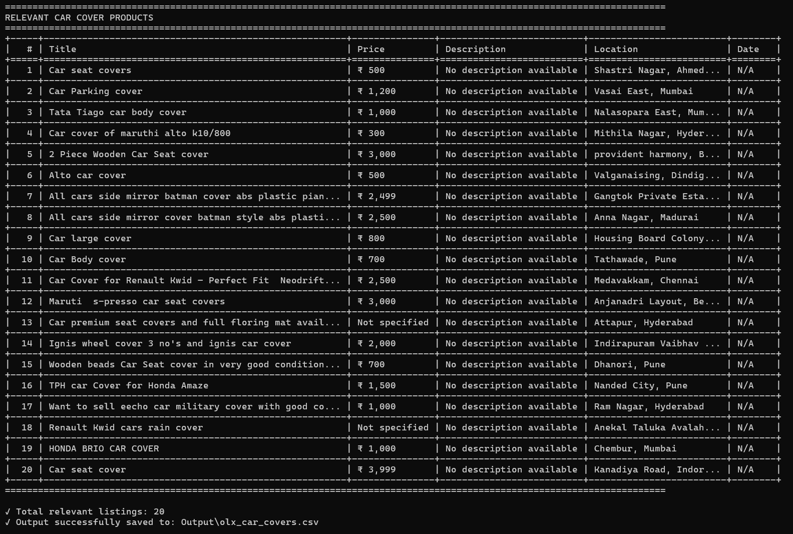

# OLX Car Cover Scraper

A Python web scraper that extracts search results from OLX listings for car covers. This tool uses Selenium with Firefox to handle dynamic content and applies smart filtering to return only relevant product listings.

## Features

- **Dynamic Content Handling**: Uses Selenium WebDriver with Firefox to load JavaScript-rendered content
- **Smart Filtering**: Automatically filters out irrelevant listings (real estate, electronics, etc.)
- **Data Extraction**: Captures title, price, description, location, and posting date
- **Multiple Output Formats**: Displays results in a formatted table and saves to CSV
- **Headless Operation**: Runs in the background without opening a visible browser window

## Requirements

- Python 3.7+
- Firefox browser installed on your system
- Dependencies listed in `requirements.txt`

## Installation

1. Clone this repository:

```bash
git clone https://github.com/aditya-gupta-me/olx-web-scraper
cd "olx-web-scraper"
```

2. Install required packages:

```bash
pip install -r requirements.txt
```

The script will automatically download and configure geckodriver when you run it for the first time.

## Usage

Simply run the scraper script:

```bash
python scraper.py
```

The script will:

1. Load the OLX search page for car covers
2. Extract all listings from the search results
3. Filter out irrelevant items using intelligent text analysis
4. Display results in a formatted table in your terminal
5. Save the data to `Output/olx_car_covers.csv`

### Sample Output

**Terminal Output:**


**Table View:**



## How It Works

The scraper performs the following steps:

1. **Page Loading**: Launches a headless Firefox browser and navigates to the OLX search URL
2. **Dynamic Content**: Waits for JavaScript to render and scrolls to trigger lazy-loaded items
3. **HTML Parsing**: Extracts the fully rendered HTML using BeautifulSoup
4. **Data Extraction**: Identifies listing elements and extracts relevant fields
5. **Smart Filtering**: Applies rule-based filtering to remove:
   - Real estate listings (apartments, flats, parking spaces)
   - Electronics (phones, laptops, TVs)
   - Items with unusually high prices (>₹50,000)
   - Listings without both "car" and "cover" terminology
6. **Output Generation**: Formats results as a table and exports to CSV

## Project Structure

```
Search Result Scraper using Python Script/
├── scraper.py              # Main scraper script
├── requirements.txt        # Python dependencies
├── README.md              # This file
├── docs/
│   └── documentation.md   # Detailed technical documentation
├── examples/              # Example output screenshots
└── Output/
    └── olx_car_covers.csv # Generated CSV output
```

## Technical Details

- **Browser Automation**: Selenium WebDriver with Firefox (geckodriver)
- **HTML Parsing**: BeautifulSoup4 for DOM traversal
- **Data Display**: Tabulate library for formatted terminal output
- **CSV Export**: Python's built-in csv module

## Filtering Logic

The scraper uses a multi-layered filtering approach:

- **Keyword Exclusion**: Removes listings containing property-related terms (bhk, flat, sqft, etc.)
- **Price Validation**: Filters out items priced above ₹50,000 (unlikely to be car covers)
- **Relevance Check**: Ensures listings contain both car-related and cover-related terms

## Output Format

CSV output includes the following columns:

- **Title**: Product name/title
- **Price**: Listed price (in INR)
- **Description**: Product description (if available)
- **Location**: City/area where the item is listed
- **Date**: When the listing was posted

> **Note on Descriptions**: OLX search result pages typically don't provide detailed descriptions for listings. Full descriptions are usually only available on individual product pages. The current implementation extracts whatever preview text is available on the search page. To get complete descriptions, the scraper would need to be extended to click into each listing individually, which would significantly increase execution time.

## Notes

- The scraper respects OLX's dynamic content loading patterns
- Filtering logic can be adjusted in the `is_relevant_car_cover()` function
- The script includes error handling for robust operation
- Output is saved in the `Output/` directory (created automatically if needed)

## Troubleshooting

**Issue**: Geckodriver not found  
**Solution**: The script uses webdriver-manager to auto-download geckodriver. Ensure you have an internet connection on first run.

**Issue**: Firefox not found  
**Solution**: Install Firefox browser on your system.

**Issue**: No listings found  
**Solution**: Check your internet connection and verify the OLX URL is accessible.

## License

This project is licensed under the MIT License
