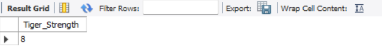
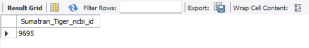
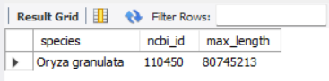
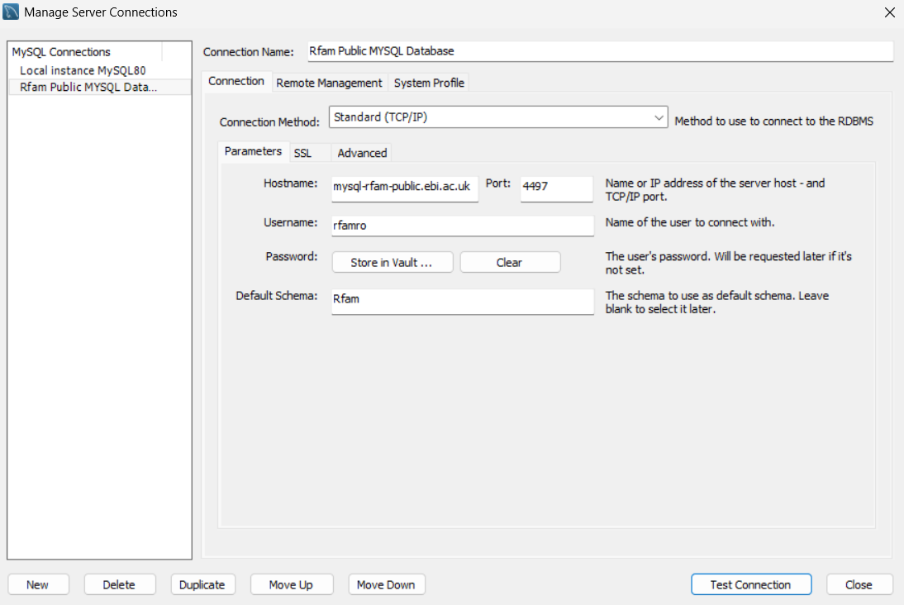
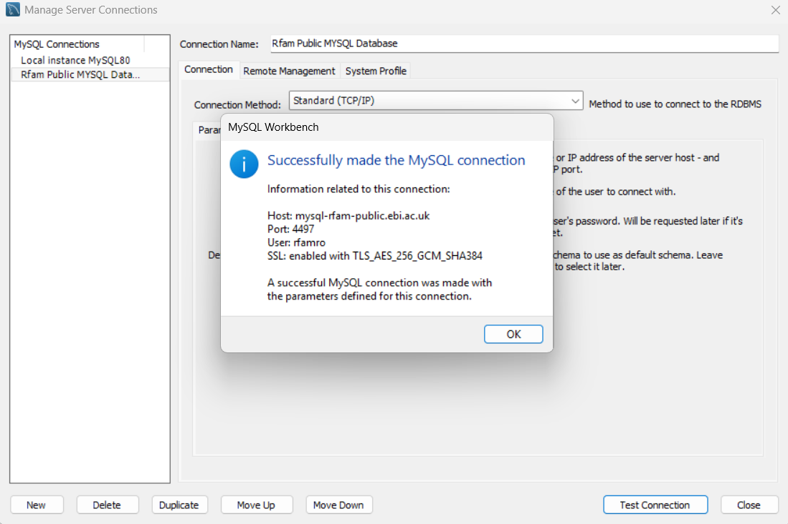

# Rfam Database SQL Queries

A collection of SQL queries for analyzing the Rfam (RNA families) database, focusing on taxonomy data, DNA sequences, and table relationships.

## About Rfam

Rfam is a database of RNA families, containing information about non-coding RNA sequences, their taxonomies, and structural annotations. This project demonstrates various SQL queries to extract meaningful insights from the database.

## Database Schema Overview

The queries work with the following main tables:

- **taxonomy** - Contains species information and NCBI taxonomy IDs
- **rfamseq** - Stores DNA/RNA sequence data with lengths and accessions
- **family** - RNA family information with accession IDs and descriptions
- **full_region** - Maps sequences to their family classifications
- **clan** & **clan_membership** - Groups related RNA families

### Key Relationships

```
taxonomy.ncbi_id ─────► rfamseq.ncbi_id
rfamseq.rfamseq_acc ──► full_region.rfamseq_acc
family.rfam_acc ──────► full_region.rfam_acc
family.rfam_acc ──────► clan_membership.rfam_acc
clan.clan_acc ────────► clan_membership.clan_acc
```

## Queries Included

### a) Taxonomy and Tiger Data

Explores tiger subspecies in the taxonomy table:

**Query 1**: Count total tiger types

```sql
SELECT COUNT(*) AS Tiger_Strength
FROM taxonomy
WHERE species LIKE '%Panthera tigris%';
```

**Result**: 8 different tiger subspecies found



**Query 2**: Find Sumatran Tiger NCBI ID

```sql
SELECT ncbi_id AS Sumatran_Tiger_ncbi_id
FROM taxonomy
WHERE species LIKE '%Panthera tigris sumatrae%';
```

**Result**: ncbi_id = 9695



### b) Table Relationships

Documents the foreign key relationships between tables for proper JOIN operations. See schema overview above for the complete relationship map.

### c) Rice DNA Sequence Analysis

Identifies which rice species has the longest DNA sequence:

```sql
SELECT t.species, t.ncbi_id, MAX(rf.length) as max_length
FROM taxonomy t
JOIN rfamseq rf ON t.ncbi_id = rf.ncbi_id
WHERE t.species LIKE '%Oryza%'
GROUP BY t.species, t.ncbi_id
ORDER BY max_length DESC
LIMIT 1;
```

The query joins taxonomy and rfamseq tables to find the Oryza (rice) species with the maximum sequence length.



### d) Pagination Query (In Progress)

A pagination query to list RNA families with DNA sequences longer than 1,000,000 base pairs, returning the 9th page with 15 results per page.

**Requirements**:

- Filter: sequence length > 1,000,000
- Order: descending by length
- Fields: family accession ID, family name, max length
- Pagination: Page 9, 15 results/page (OFFSET 120, LIMIT 15)

## Setup

### Prerequisites

- MySQL client or GUI tool (MySQL Workbench, DBeaver, etc.)

### Database Connection

You can connect to the database on command line:

```bash
mysql --user rfamro --host mysql-rfam-public.ebi.ac.uk --port 4497 --database Rfam
```





### Running the Queries

Execute queries from the SQL file or copy individual queries into your preferred SQL client.

## Query Patterns Used

- **Pattern Matching**: `LIKE '%pattern%'` for flexible species name searches
- **Aggregation**: `COUNT()`, `MAX()` for statistical analysis
- **Joins**: `INNER JOIN` to combine data across tables
- **Grouping**: `GROUP BY` for aggregating by species
- **Sorting**: `ORDER BY DESC` for descending order
- **Limiting**: `LIMIT` for pagination and top results
