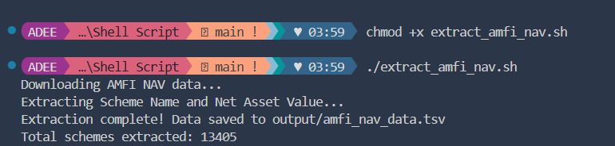

# India Mutual Fund NAV Extractor

A bash script that downloads and extracts mutual fund scheme names and their Net Asset Values (NAV) from AMFI (Association of Mutual Funds in India).

## What It Does

1. Downloads the latest NAV data from AMFI's official portal
2. Parses the semicolon-delimited data file
3. Extracts scheme names and their NAV values
4. Saves results in TSV format with organized directory structure

## Prerequisites

- Bash shell (Linux, macOS, or Git Bash/WSL on Windows)
- `curl` and `awk` (usually pre-installed)

## Usage

```bash
chmod +x extract_amfi_nav.sh
./extract_amfi_nav.sh
```

## Output Structure

The script creates two directories:

```
output/
  └── amfi_nav_data.tsv    # Extracted scheme names and NAV values
asset/
  └── NAVAll.txt           # Raw downloaded data from AMFI
```

**Sample TSV format:**

```
Scheme Name                          Net Asset Value
HDFC Balanced Advantage Fund         250.45
ICICI Prudential Bluechip Fund       75.32
```

## How It Works

- **Downloads** data from `https://portal.amfiindia.com/spages/NAVAll.txt`
- **Filters** valid NAV entries (6 fields with numeric NAV values)
- **Cleans** HTML entities (`&amp;`, `&lt;`, `&gt;`)
- **Organizes** output into separate directories

## Data Fields Extracted

From the 6-field source format, the script extracts:

- Field 4: **Scheme Name**
- Field 5: **Net Asset Value**

## Example Run



## Data Source

[AMFI NAV Portal](https://portal.amfiindia.com/spages/NAVAll.txt)
